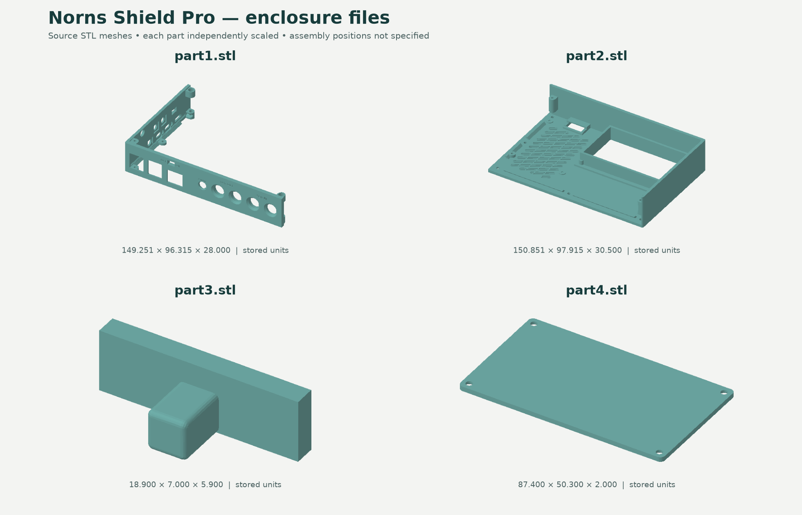

# Norns Shield Pro

Hardware files for Freepoet's Norns Shield Pro, a project based on the original Norns Shield and Norns Shield XL. The design includes audio circuitry, physical controls, an OLED interface, and battery/power circuitry for a Raspberry Pi-based instrument.

[中文说明](README.zh-CN.md) · [Hardware guide](docs/HARDWARE.md) · [Design gallery](docs/GALLERY.md) · [Licensing](LICENSE.md)

*Individual mesh previews, independently centered and scaled. These are not an assembly diagram or photographs of a finished instrument. See the [gallery](docs/GALLERY.md) for panel and schematic previews.*

## Project status

This repository contains a hardware documentation snapshot: manufacturing exports, a schematic PDF, a bill of materials, and enclosure files. It does not include editable PCB/schematic source projects or firmware.

These files are design reference materials. Confirm the circuit revision, component specifications, and manufacturing parameters for your intended build; a complete assembly and validation guide is not included.

The original project description identifies noise reduction as a design goal. No comparative measurements are included, so this repository does not claim a measured improvement. Kit information is available from the [Freepoet store](https://freepoet.co.uk/).

## Find the right file

| File | Contents | Use |
| --- | --- | --- |
| [BOM.xlsx](BOM.xlsx) | Original parts list, including electronics and mechanical/accessory items | Look up components, quantities, and footprints |
| [BOM.csv](docs/BOM.csv) | Text copy of the original workbook's populated rows | Browse and search the BOM on GitHub; original values are preserved |
| [Norns Shield Pro Gerber.zip](Gerber/Norns%20Shield%20Pro%20Gerber.zip) | Four copper layers, masks, silkscreens, outline, drill files, and flying-probe data | PCB manufacturing export; board ordering parameters are not fully documented |
| [Schematic20250606.pdf](Schematic/Schematic20250606.pdf) | One-sheet schematic with power, main function, controls, ports, and OLED sections | Explore the published circuit and signal names |
| [20250523.ai](Top%20cover/20250523.ai) | Illustrator panel drawing, with a PDF-compatible preview | Inspect the panel outline and cutouts |
| [part1.stl](Top%20cover/part1.stl), [part2.stl](Top%20cover/part2.stl), [part3.stl](Top%20cover/part3.stl), [part4.stl](Top%20cover/part4.stl) | Four separate enclosure meshes | Inspect in a mesh viewer or slicer; dimensions and limitations are in the guide |

Original asset paths are retained so existing download links keep working.

## Hardware overview

The supplied BOM lists a Raspberry Pi 4B with 1 GB RAM, a 32 GB microSD card, a 2.7-inch OLED plus cover, three rotary encoders, and three main pushbuttons. These entries describe the supplied configuration, not a tested compatibility matrix.

| Area | What the files show |
| --- | --- |
| Audio | The BOM specifies a `CS4270-CZZ` codec. The circuit includes audio inputs/outputs and a 12.288 MHz oscillator. |
| Controls | Three `PEC11R-4015F-S0024` encoders and three `CPG135001D01` switches, plus power/control switches. |
| Display | OLED interface with a 30-position connector and associated supply circuitry. |
| Power | USB-C input, an 18650 holder, and charging/converter components. Cell requirements, current limits, and runtime are not documented. |
| Ports | Audio connectors and TX/RX-related circuitry, including an optocoupler. Cable wiring and external connector conventions still need documentation. |

See the [hardware guide](docs/HARDWARE.md) for export dates, enclosure dimensions, manufacturing-file contents, and the information still needed for a reproducible build.

## Start here

1. Use the [hardware guide](docs/HARDWARE.md) to identify the files you need.
2. Open the [original BOM](BOM.xlsx) or its [browser-readable copy](docs/BOM.csv) for parts and quantities.
3. Inspect the schematic and Gerber files together. Confirm component specifications and manufacturing parameters for your build.
4. Inspect the enclosure meshes and panel drawing. Confirm units, tolerances, and hardware fit before fabrication.
5. Check the [license scope](LICENSE.md) and [attribution](NOTICE.md) before redistributing design files or modifications.

## Maintaining this repository

- Update the source design first, then export the schematic, BOM, manufacturing files, and any affected mechanical files together.
- After replacing assets, run `python3 scripts/refresh_metadata.py` to refresh the readable BOM and checksums. Run `python3 scripts/refresh_metadata.py --check` to detect stale generated metadata.
- Update [the hardware guide](docs/HARDWARE.md) and previews when their source files change. The metadata script does not regenerate images or validate circuit correctness.
- Use the Git commit ID to identify this snapshot. No numbered hardware release is assigned by this documentation refresh.

See [CONTRIBUTING.md](CONTRIBUTING.md) for useful issue reports and change submissions.

## Credits and licensing

The electronic design builds on [Norns Shield](https://github.com/monome/norns-shield) by monome / Brian Crabtree and [shieldXL](https://github.com/okyeron/shieldXL) by Steven Noreyko / denki-oto. Freepoet independently designed the enclosure STL files and AI panel drawing.

- **Electronic design, BOM, and manufacturing exports:** GPLv3.
- **Original enclosure/panel designs, mechanical previews, documentation, and utilities:** MIT.
- **Schematic preview:** GPLv3, as a rendering of the electronic design.

See [LICENSE.md](LICENSE.md) for exact file scope and full license texts, and [NOTICE.md](NOTICE.md) for attribution and documented changes. Copyright (c) 2026 Freepoet for its original contributions; upstream rights are retained.

The editable EDA source still needs to be published for the corresponding design revision. Adding license notices does not replace source-delivery obligations. No official affiliation with or support from monome or denki-oto is implied.
