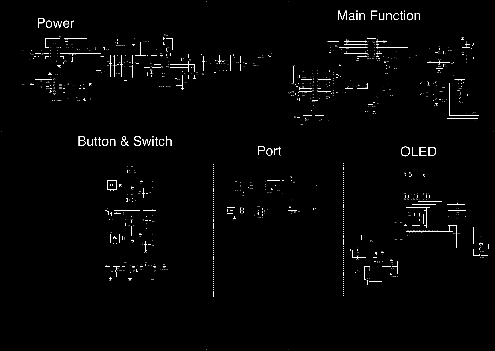
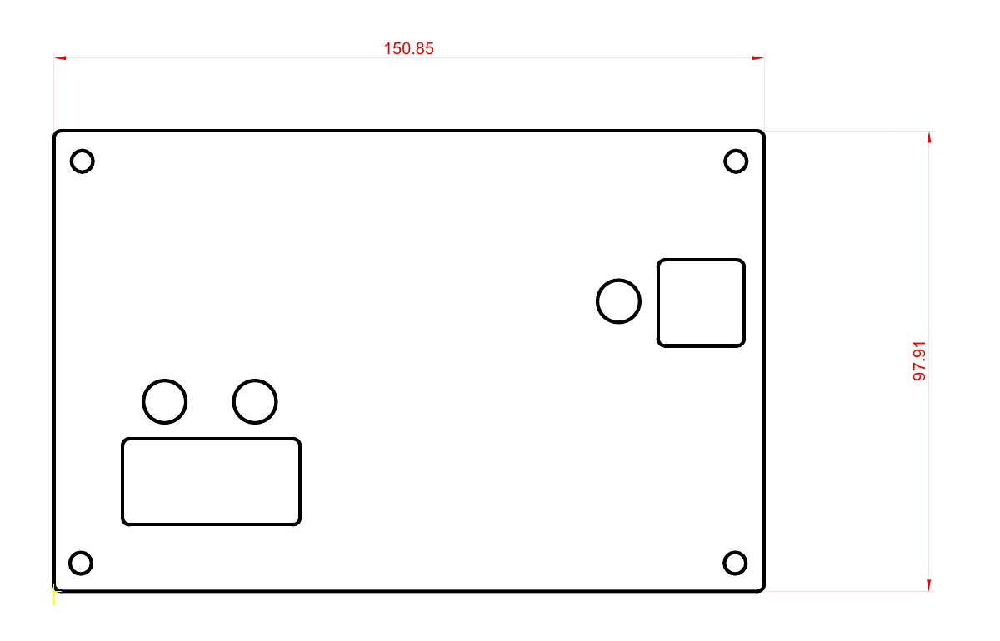

# Hardware and file guide

[Repository overview](../README.md) · [Chinese README](../README.zh-CN.md) · [Design gallery](GALLERY.md)

Documentation updated on 2026-10-08. Dates below identify files and exports; they are not a unified hardware revision.

## Asset provenance

| Asset | Date evidence | Interpretation |
| --- | --- | --- |
| `BOM.xlsx` | Worksheet `BOM_Board1_4_PCB4_4_2025-11-11` | Worksheet name contains 2025-11-11; 79 populated item rows follow the header |
| Gerber ZIP | Headers: `EasyEDA Pro v3.1.59, 2025-11-11 21:11:01` | Export timestamp as stored; no timezone is specified in these headers |
| `Schematic20250606.pdf` | Filename: 20250606; original PDF creation metadata: 2025-11-11 22:44:40 +08:00 | USB-C input annotation translated to English on 2026-10-08; filename retained |
| `20250523.ai` | Filename: 20250523; original creation and modification metadata refer to 2025-11-11 with differing offsets | Descriptive title metadata localized to English on 2026-10-08; geometry retained |
| Four STL files | Binary STL headers contain no useful revision or unit information | Track by file checksum and Git revision |

The [SHA-256 manifest](assets.sha256) identifies the eight current hardware assets, including presentation-only localization. It does not certify their design or manufacturing suitability. No firmware or editable EDA/mechanical source project is supplied, apart from the Illustrator panel drawing. See [NOTICE.md](../NOTICE.md) for provenance and [LICENSE.md](../LICENSE.md) for the GPLv3 electronic/MIT mechanical license split.

## Manufacturing archive

The [Gerber ZIP](../Gerber/Norns%20Shield%20Pro%20Gerber.zip) contains 17 manufacturing/test files and two license/attribution files under one directory. The licensing update preserves the contents of all 17 original files:

| Group | Files / extensions |
| --- | --- |
| Copper | Top `.GTL`, bottom `.GBL`, inner `.G1` and `.G2` |
| Solder mask | Top `.GTS`, bottom `.GBS` |
| Paste mask | Top `.GTP`, bottom `.GBP` |
| Silkscreen | Top `.GTO`, bottom `.GBO` |
| Outline | `Gerber_BoardOutlineLayer.GKO` |
| Drilling | `Drill_NPTH_Through.DRL`, `Drill_PTH_Through.DRL`, `Drill_PTH_Through_Via.DRL` |
| Reference layers | `Gerber_DocumentLayer.GDL`, `Gerber_DrillDrawingLayer.GDD` |
| Test export | `FlyingProbeTesting.json` with component positions and pin/net records |
| Licensing | `LICENSE.txt` (GPLv3) and `NOTICE.txt` (attribution and source-availability notice) |

The copper files establish that this is a four-layer export. The Gerber/drill headers specify millimeters; the flying-probe JSON specifies mils. Do not mix these coordinate units.

The test export is useful for cross-checking references and connectivity, but it is not a documented assembly placement file. It includes auxiliary `PAD…` records in addition to physical component records. Do not use its raw row count as a parts count.

Confirm board thickness, stackup, copper weights, finish, fabrication tolerances, and assembly options for your intended build. These ordering parameters are not specified by the file list alone.

## Schematic



Download the [vector PDF](../Schematic/Schematic20250606.pdf) to read individual pin names and values. The overview above is for navigation. Its USB-C input annotation was translated to English; circuit symbols, values, and geometry were preserved.

The sheet groups the design into `Power`, `Main Function`, `Button & Switch`, `Port`, and `OLED`.

## Bill of materials

[BOM.xlsx](../BOM.xlsx) is the source workbook. [BOM.csv](BOM.csv) is a generated text view of all 80 populated rows, including the header, with the workbook's values preserved.

Electronics occupy rows 2–71; display, hardware, and accessory items occupy rows 72–80. Use worksheet row numbers when referring to a specific entry. Confirm part specifications and population choices for the circuit revision you intend to build.

## Mechanical files

Freepoet independently designed the four STL models and the AI panel drawing. These files and their mechanical previews use the [MIT license](../LICENSES/MIT.txt).


The previews are independently centered and scaled. The files' absolute coordinates differ, and their placement in the preview does not define an assembly transform. Part roles have not been assigned because the repository supplies no assembly drawing.

| File | Triangles | X × Y × Z extent in stored coordinate units |
| --- | ---: | --- |
| [part1.stl](../Top%20cover/part1.stl) | 41,748 | 149.251 × 96.315 × 28.000 |
| [part2.stl](../Top%20cover/part2.stl) | 7,894 | 150.851 × 97.915 × 30.500 |
| [part3.stl](../Top%20cover/part3.stl) | 316 | 18.900 × 7.000 × 5.900 |
| [part4.stl](../Top%20cover/part4.stl) | 6,548 | 87.400 × 50.300 × 2.000 |

STL does not encode a length unit. The sizes are consistent with a millimeter-scale enclosure, but that interpretation must be confirmed against the physical hardware. The AI drawing labels its panel outline `150.85` by `97.91`; this numerical similarity does not establish fit or manufacturing tolerance.



This is a cropped rendering of the supplied AI drawing, not a photograph. Download the AI file for the vector geometry. Image sources and license scopes are listed in the [gallery](GALLERY.md).

## Build documentation

This snapshot provides design reference files. A complete assembly guide, verified printing settings, firmware installation guide, and physical validation record are not included. Check fit, fabrication settings, component specifications, and power requirements against the actual hardware before building.

## Refreshing derived files

From the repository root, with Python 3:

```sh
python3 scripts/refresh_metadata.py
python3 scripts/refresh_metadata.py --check
```

The script uses only the Python standard library. It reads the first worksheet of the original workbook, refreshes `docs/BOM.csv`, and hashes the original hardware assets into `docs/assets.sha256`. It preserves source values, fails rather than silently exporting formulas, and never edits hardware assets.

Images require a separate refresh when the model or schematic changes. The schematic overview was rendered from the supplied PDF. The enclosure image was rendered from the supplied STL triangles. Both are illustrations of these exact inputs, not alternative manufacturing files.
